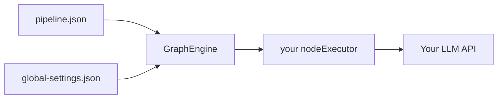

# Bring your own LLM (BYO endpoint)

arc-dag ships a **DAG runner** (`GraphEngine`). For `genText` nodes you can either pass credentials on the engine (`llm` option) and use `createBuiltinNodeExecutor()`, or wire your own provider in a custom **`nodeExecutor`**.

Full reference: [LLM configuration](./llm-config.md).

## Built-in LLM config (npm package)

Pass provider name, API key, and model on `GraphEngine` — no `.env` required in production:

```typescript
import {
  GraphEngine,
  loadFlowFromFile,
  createBuiltinNodeExecutor,
} from "arc-dag";

const flow = await loadFlowFromFile("./pipeline.json");

const engine = new GraphEngine({
  flow,
  llm: {
    provider: "bedrock",
    apiKey: process.env.BEDROCK_API_KEY!,
    modelId: "us.anthropic.claude-sonnet-4-6",
    region: "us-east-1",
  },
  nodeExecutor: createBuiltinNodeExecutor(),
});

await engine.run();
```

OpenAI-compatible:

```typescript
llm: {
  provider: "openai",
  apiKey: process.env.LLM_API_KEY!,
  baseUrl: "https://api.openai.com/v1",
  model: "gpt-4o",
}
```

Values are merged into each node's `data.settings` (`llmProvider`, `bedrockApiKey`, `modelId`, `llmApiBase`, …). `globalSettings` can still override non-secret fields (temperature, system prompt).

---

## Custom `nodeExecutor` (BYO)

You can also connect any endpoint yourself in **`nodeExecutor`** — typically for `genText`, `llm`, or `chat` node types from your pipeline JSON.

## How it fits together



| Piece | Your responsibility |
|-------|---------------------|
| Pipeline JSON | From your UI or ArcPX export (`nodes`, `edges`) |
| `llm` (optional) | Provider (`bedrock` \| `openai`), API key, model/region — see [API](./api.md) |
| `globalSettings` | Model name, temperature, system prompt |
| Env vars | Optional for local dev; pass `llm` in app code for production |
| `nodeExecutor` | Switch on `node.type`, call your LLM for chat nodes |

## 1. Environment variables

Copy the template and create your local **`.env`** (gitignored):

```bash
cp .env.template .env
```

Edit `.env` — or export the same variables in your shell:

```bash
# OpenAI
export LLM_API_BASE=https://api.openai.com/v1
export LLM_API_KEY=sk-your-key-here
export LLM_MODEL=gpt-4o

# Ollama (local)
export LLM_API_BASE=http://localhost:11434/v1
export LLM_API_KEY=ollama
export LLM_MODEL=llama3.2

# Azure OpenAI (example)
export LLM_API_BASE=https://YOUR_RESOURCE.openai.azure.com/openai/deployments/YOUR_DEPLOYMENT
export LLM_API_KEY=your-azure-key
export LLM_MODEL=your-deployment-name
```

Template file: [`.env.template`](../.env.template) — copy to `.env` and fill in values.

| Variable | Required | Description |
|----------|----------|-------------|
| `LLM_API_BASE` | yes | Root URL with `/v1` path where compatible with OpenAI chat API |
| `LLM_API_KEY` | yes* | Bearer token (*Ollama may not enforce it) |
| `LLM_MODEL` | optional | Default model if omitted from `global-settings.json` |

## 2. Global settings file

Copy [`examples/global-settings.example.json`](../examples/global-settings.example.json):

```json
{
  "model": "gpt-4o",
  "temperature": 0.5,
  "maxOutputTokens": 4096,
  "systemPrompt": "You are a helpful assistant",
  "serviceMode": "built-in"
}
```

`GraphEngine` merges these into each node’s `data.settings` at run time.

## 3. What the executor receives (`genText` example)

For a chat node, arc-dag calls your handler with a full pipeline node:

```json
{
  "id": "genText_abc",
  "type": "genText",
  "data": {
    "nodeData": "Summarize the upstream data",
    "sourceData": [ "..." ],
    "settings": {
      "model": "gpt-4o",
      "temperature": 0.5,
      "maxOutputTokens": 4096,
      "systemPrompt": "You are a helpful assistant"
    }
  }
}
```

| Field | Use in your LLM call |
|-------|----------------------|
| `data.nodeData` | User prompt for this step |
| `data.sourceData` | Upstream outputs / chat history (array or single value) |
| `data.settings.model` | Model id |
| `data.settings.temperature` | Sampling temperature |
| `data.settings.maxOutputTokens` | Max tokens |
| `data.settings.systemPrompt` | System message |

Use [`formatChatTurn` / `formatChatHistory`](./api.md) from `arc-dag` if you build multi-turn history in Gemini vs OpenAI shapes.

## 4. Quick run (included example)

The repo ships an **OpenAI-compatible** client (fetch-based, no extra npm deps):

```bash
cp .env.template .env
# set LLM_API_BASE, LLM_API_KEY, LLM_MODEL in .env

cp examples/global-settings.example.json ./my-settings.json
# edit temperature / systemPrompt if needed

npm run run:llm
```

Or:

```bash
node examples/run-with-llm.mjs ./pipeline.json ./global-settings.json
```

Implementation files:

- [`examples/lib/chat-completions.example.mjs`](../examples/lib/chat-completions.example.mjs) — `chatComplete()` helper
- [`examples/run-with-llm.mjs`](../examples/run-with-llm.mjs) — wires `genText` / `llm` / `chat` types

## 5. Wire into your own app (TypeScript)

```typescript
import { GraphEngine, loadFlowFromFile } from "arc-dag";

const flow = await loadFlowFromFile("./pipeline.json");

const engine = new GraphEngine({
  flow,
  globalSettings: {
    model: process.env.LLM_MODEL!,
    temperature: 0.5,
    maxOutputTokens: 4096,
    systemPrompt: "You are a helpful assistant",
  },
  nodeExecutor: async (node) => {
    if (node.type === "genText" || node.type === "llm") {
      const res = await fetch(`${process.env.LLM_API_BASE}/chat/completions`, {
        method: "POST",
        headers: {
          "Content-Type": "application/json",
          Authorization: `Bearer ${process.env.LLM_API_KEY}`,
        },
        body: JSON.stringify({
          model: node.data?.settings?.model,
          temperature: node.data?.settings?.temperature,
          max_tokens: node.data?.settings?.maxOutputTokens,
          messages: [
            { role: "system", content: String(node.data?.settings?.systemPrompt ?? "") },
            { role: "user", content: String(node.data?.nodeData ?? "") },
          ],
        }),
      });
      const json = await res.json();
      return json.choices[0].message.content;
    }
    // ...other node types
    throw new Error(`Unknown type: ${node.type}`);
  },
});

await engine.run();
```

Swap `fetch` for `@anthropic-ai/sdk`, `@google/generative-ai`, etc. — arc-dag only needs your handler to return the node output (usually a string).

## AWS Bedrock (`node.type`: `LLM`)

ArcPX-style Bedrock **Converse** API (Bearer token) is implemented in:

- [`examples/lib/bedrock-converse.mjs`](../examples/lib/bedrock-converse.mjs)
- [`examples/node-types/llm-bedrock/`](../examples/node-types/llm-bedrock/)

```bash
cp .env.bedrock.template .env.bedrock
# edit BEDROCK_API_KEY in .env.bedrock
node examples/run-with-llm.mjs ./pipeline.json
```

Template: [`.env.bedrock.template`](../.env.bedrock.template) (gitignored copy: `.env.bedrock`).

History format (`user` / `model` + `parts[].text`) is converted to Bedrock `user` / `assistant` messages automatically. Locally, `.env.bedrock` replaces Python `get_service_key(userId, "bedrock")`.

## 6. Provider-specific notes

| Provider | `LLM_API_BASE` | Notes |
|----------|----------------|--------|
| OpenAI | `https://api.openai.com/v1` | Standard chat completions |
| Ollama | `http://localhost:11434/v1` | Run `ollama serve` first |
| LM Studio | `http://localhost:1234/v1` | Enable local server in app |
| OpenRouter | `https://openrouter.ai/api/v1` | Same schema; set key from dashboard |
| Anthropic | — | Not OpenAI-compatible; use Anthropic SDK in `nodeExecutor` instead of the example helper |

## 7. Security checklist

- [ ] Keys only in env / secret manager — **not** in pipeline JSON
- [ ] `.env` in `.gitignore`
- [ ] Rotate keys if accidentally committed
- [ ] Rate-limit and log in your wrapper for production

## See also

- [Documentation index](./README.md)
- [Payload guide](./payload-guide.md)
- [Scripts](./scripts.md)
- [run-local.mjs](../examples/run-local.mjs) — stubs without LLM
