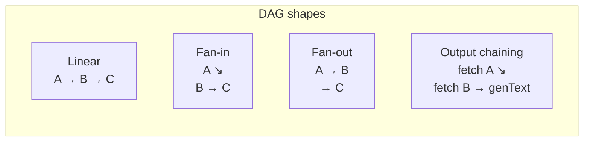

# Example pipelines

Each example has a **Mermaid diagram**, run command, and pipeline JSON. All diagrams use **node id** + **`node.type`** from the actual files.

## Overview

```mermaid
flowchart TB
  subgraph linear["Linear — npm run quickstart"]
    direction LR
    L1["input_1<br/>text"] --> L2["cell_1<br/>pipeNode"] --> L3["output_1<br/>pipeNode"]
  end

  subgraph fanin["Fan-in — npm run run:fan-in"]
    direction LR
    FA["input_a<br/>text"] --> M["merge_1<br/>pipeNode"]
    FB["input_b<br/>text"] --> M
    M --> FF["final_1<br/>pipeNode"]
  end

  subgraph fanout["Fan-out — npm run run:fan-out"]
    direction LR
    S["source_1<br/>text"] --> OA["out_a<br/>pipeNode"]
    S --> OB["out_b<br/>pipeNode"]
    S --> OC["out_c<br/>pipeNode"]
  end

  subgraph scraper["Web scraper — npm run run:web-scraper"]
    direction LR
    W1["fetch_1<br/>webpage"] --> W2["summarize_1<br/>pipeNode<br/>$page_text"]
  end

  subgraph llm["LLM demo — npm run run:llm"]
    direction LR
    P["prompt_1<br/>text"] --> G1["llm_1<br/>genText"]
  end

  subgraph chain["Output chaining — npm run run:output-chaining"]
    direction LR
    FE["fetch_example<br/>webpage<br/>$ontario_gov"] --> GT["genText_we_are_canada<br/>genText"]
    FW["fetch_wikipedia<br/>webpage<br/>$canada_holidays"] --> GT
  end

  subgraph airepos["AI repos — ArcPX export"]
    direction LR
    AR["aiRepos_c2a16…<br/>aiRepos"] --> PN["pipeNode_333e…<br/>pipeNode<br/>$adaptive_json_agent"] --> GT2["genText_0c27…<br/>genText"]
  end
```

## Catalog

| Example | Command | Diagram doc |
|---------|---------|-------------|
| Linear (3 nodes) | `npm run quickstart` | [linear-pipeline.md](./linear-pipeline.md) |
| Fan-in (4 nodes) | `npm run run:fan-in` | [fan-in.md](./fan-in.md) |
| Fan-out (4 nodes) | `npm run run:fan-out` | [fan-out.md](./fan-out.md) |
| Web scraper | `npm run run:web-scraper` | [web-scraper-pipeline.md](./web-scraper-pipeline.md) |
| LLM demo | `npm run run:llm` | [llm-demo.md](./llm-demo.md) |
| Output chaining | `npm run run:output-chaining` | [output-chaining.md](./output-chaining.md) |
| AI repos (ArcPX) | custom executor | [ai-repos-pipeline.md](./ai-repos-pipeline.md) |

## Pattern guide

[Scripts](../scripts.md) · [Payload guide](../payload-guide.md) · [Docs index](../README.md)
