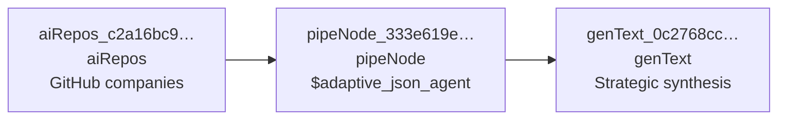
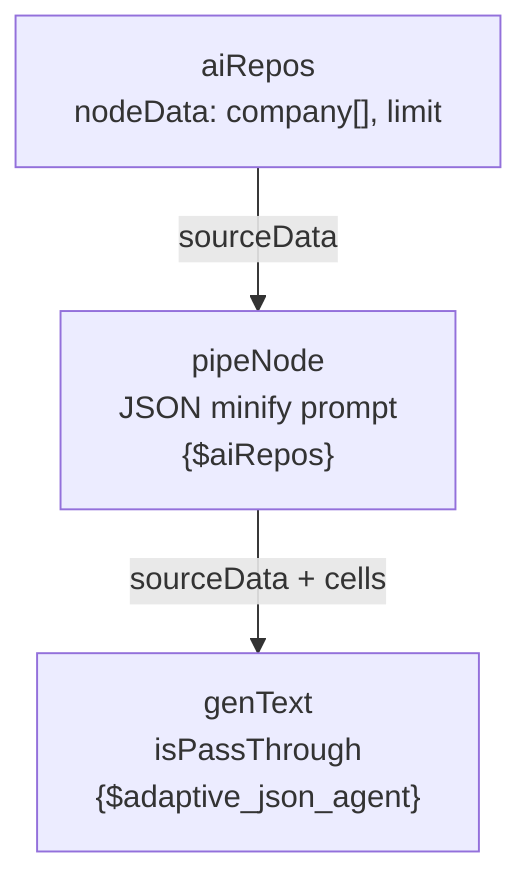

# AI repos pipeline (ArcPX-style)

**File:** [`examples/pipeline-ai-repos.normalized.json`](../../examples/pipeline-ai-repos.normalized.json)  
Derived from a real ArcPX export. Requires a custom `nodeExecutor` (and [BYO LLM](../byo-llm.md) for `genText`).



Placeholder chain (`{$aiRepos}` → pipe → `{$adaptive_json_agent}` → genText):



## Nodes

### `aiRepos` (data source)

`data.nodeData` is an **object**:

```json
{
  "company": ["nvidia", "openai", "anthropic", "google-deepmind", "meta", "huggingface"],
  "limit": 2,
  "fetch_readme": false
}
```

### `pipeNode` (transform)

- `outputTarget`: `"$adaptive_json_agent"`
- `nodeData`: prompt template with `{$aiRepos}` placeholder

### `genText` (LLM)

- `isPassThrough`: `true`
- `nodeData`: prompt with `{$adaptive_json_agent}`
- Receives aggregated `sourceData` at run time

## Runtime

The engine augments each node with `data.sourceData` and `data.settings` before `nodeExecutor` runs. Implement `{$variable}` substitution and API/LLM calls in your handler.

[Payload guide](../payload-guide.md) · [Docs index](../README.md)
