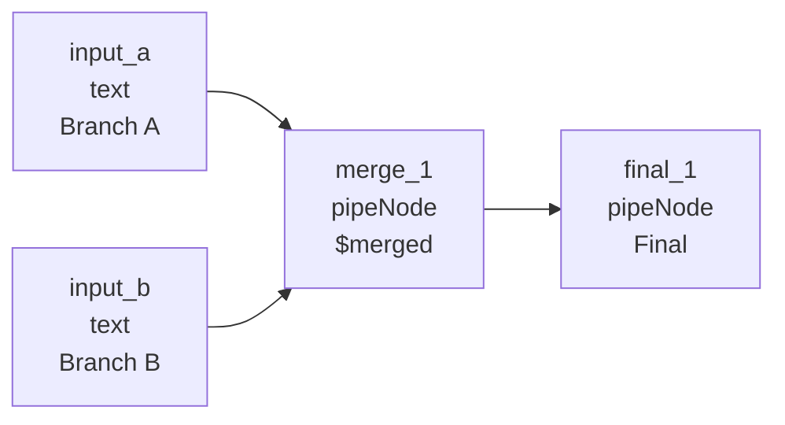
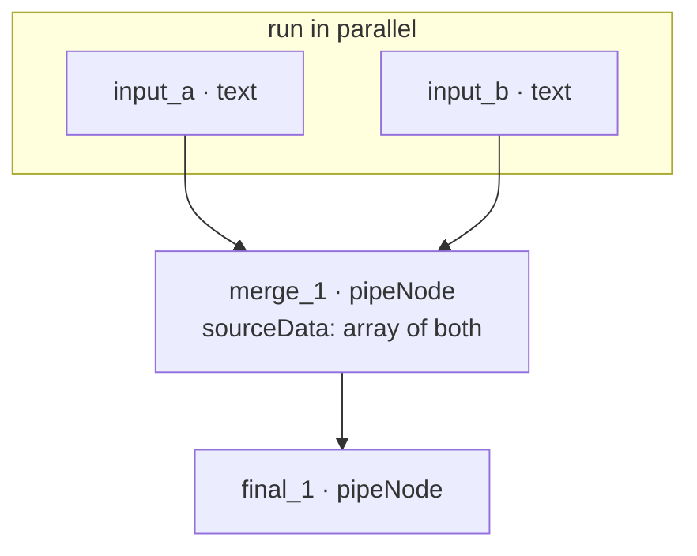

# Fan-in pipeline (4 nodes)

**Run:** `npm run run:fan-in`  
**File:** [`examples/fan-in-pipeline.json`](../../examples/fan-in-pipeline.json)

Two branches → merge → final leaf.



Parallel branches (same row = concurrent):



| Step | What happens |
|------|----------------|
| 1 | `input_a` and `input_b` run **in parallel** |
| 2 | `merge_1` waits for both; `sourceData` is an **array** |
| 3 | `final_1` runs after merge; engine sets `data.sourceData` to merge’s output |

## Data flow (what you should see)

The **GraphEngine** passes upstream results as `data.sourceData` before your handler runs. The demo trace logs that input vs the handler return — it does not change core behavior.

- `input_a` / `input_b` — emit `nodeData` strings
- `merge_1` — `sourceData` is an **array** of both branch outputs
- `final_1` — `sourceData` is merge’s return value (`pipeNode` → `{ value, label }`)

```bash
npm run run:fan-in
```

Example trace (fan-in / fan-out pipelines only):

```
  merge_1 (pipeNode, Merge):
    receivedFromUpstream (engine sourceData): ["from branch B", "from branch A"]
    emitted (handler return): { "value": [...], "label": "Merge" }
```

Order in `sourceData` follows engine dependency order (newest parent first).

## Payload

```json
{
  "nodes": [
    {
      "id": "input_a",
      "type": "text",
      "position": { "x": 0, "y": 0 },
      "data": { "label": "Branch A", "nodeData": "from branch A" }
    },
    {
      "id": "input_b",
      "type": "text",
      "position": { "x": 0, "y": 120 },
      "data": { "label": "Branch B", "nodeData": "from branch B" }
    },
    {
      "id": "merge_1",
      "type": "pipeNode",
      "position": { "x": 320, "y": 60 },
      "data": { "label": "Merge", "outputTarget": "$merged" }
    },
    {
      "id": "final_1",
      "type": "pipeNode",
      "position": { "x": 600, "y": 60 },
      "data": { "label": "Final" }
    }
  ],
  "edges": [
    { "id": "e-a-merge", "source": "input_a", "target": "merge_1" },
    { "id": "e-b-merge", "source": "input_b", "target": "merge_1" },
    { "id": "e-merge-final", "source": "merge_1", "target": "final_1" }
  ]
}
```

## When to use

- Combine two API fetches before one LLM step
- Merge parallel feature branches in a workflow

[Fan-out](./fan-out.md) · [Docs index](../README.md)
