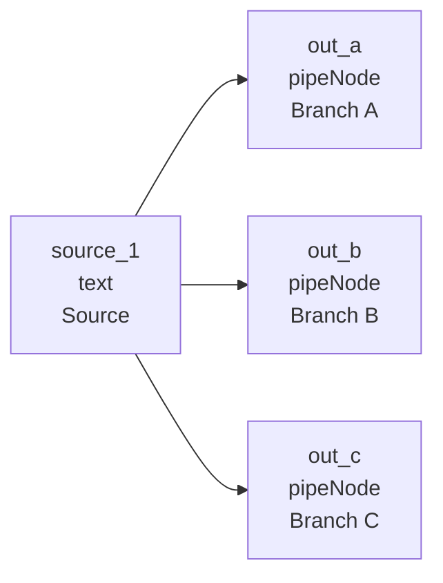
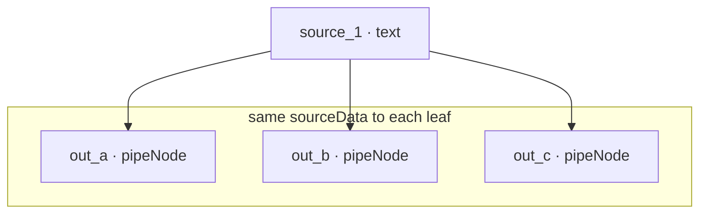

# Fan-out pipeline (4 nodes)

**Run:** `npm run run:fan-out`  
**File:** [`examples/fan-out-pipeline.json`](../../examples/fan-out-pipeline.json)

One source → three parallel leaves.



After `source_1` completes, three leaves run in parallel:



| Step | What happens |
|------|----------------|
| 1 | `source_1` runs first |
| 2 | `out_a`, `out_b`, `out_c` run **in parallel** |
| 3 | Each leaf gets the same `data.sourceData` from `source_1` |

## Data flow (what you should see)

The engine sets each leaf’s `data.sourceData` to the source output before `nodeExecutor` runs. Demo trace only — [`src/graph-engine.ts`](../../src/graph-engine.ts) is unchanged.

```bash
npm run run:fan-out
```

Example trace:

```
  out_a (pipeNode, Branch A):
    receivedFromUpstream (engine sourceData): ["shared upstream payload"]
    emitted (handler return): { "value": ["shared upstream payload"], "label": "Branch A" }
```

All three leaves show the same upstream string in `sourceData`.

## Payload

```json
{
  "nodes": [
    {
      "id": "source_1",
      "type": "text",
      "position": { "x": 0, "y": 120 },
      "data": { "label": "Source", "nodeData": "shared upstream payload" }
    },
    {
      "id": "out_a",
      "type": "pipeNode",
      "position": { "x": 320, "y": 0 },
      "data": { "label": "Branch A" }
    },
    {
      "id": "out_b",
      "type": "pipeNode",
      "position": { "x": 320, "y": 120 },
      "data": { "label": "Branch B" }
    },
    {
      "id": "out_c",
      "type": "pipeNode",
      "position": { "x": 320, "y": 240 },
      "data": { "label": "Branch C" }
    }
  ],
  "edges": [
    { "id": "e-src-a", "source": "source_1", "target": "out_a" },
    { "id": "e-src-b", "source": "source_1", "target": "out_b" },
    { "id": "e-src-c", "source": "source_1", "target": "out_c" }
  ]
}
```

## Fan-in vs fan-out

| Pattern | Shape |
|---------|--------|
| **Fan-in** | Many → one → leaf |
| **Fan-out** | One → many leaves |

## When to use

- One fetch → summarize + translate + tag in parallel
- Broadcast one LLM result to multiple export paths

[Fan-in](./fan-in.md) · [Docs index](../README.md)
