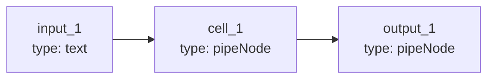
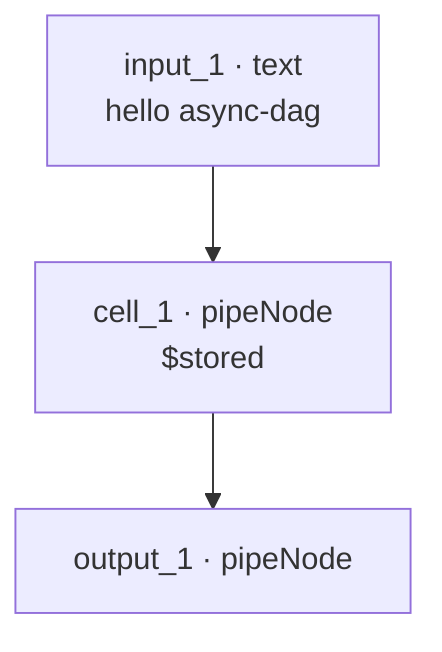

# Linear pipeline (3 nodes)

**Run:** `npm run quickstart`  
**File:** [`examples/quickstart-pipeline.json`](../../examples/quickstart-pipeline.json)

Input → store → result. One upstream edge per step.



**Order:** `input_1` → `cell_1` → `output_1` (sequential — each step waits for its parent)



## Payload

```json
{
  "nodes": [
    {
      "id": "input_1",
      "type": "text",
      "position": { "x": 0, "y": 0 },
      "data": { "label": "Input", "nodeData": "hello async-dag" }
    },
    {
      "id": "cell_1",
      "type": "pipeNode",
      "position": { "x": 280, "y": 0 },
      "data": { "label": "Store", "outputTarget": "$stored" }
    },
    {
      "id": "output_1",
      "type": "pipeNode",
      "position": { "x": 560, "y": 0 },
      "data": { "label": "Result" }
    }
  ],
  "edges": [
    { "id": "e-input-cell", "source": "input_1", "target": "cell_1" },
    { "id": "e-cell-output", "source": "cell_1", "target": "output_1" }
  ]
}
```

## Expected output

```
Loaded flow: 3 nodes, 2 edges
→ start input_1
✓ complete input_1
→ start cell_1
✓ complete cell_1
→ start output_1
✓ complete output_1
```

[Back to docs index](../README.md)
