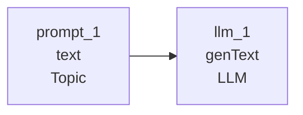
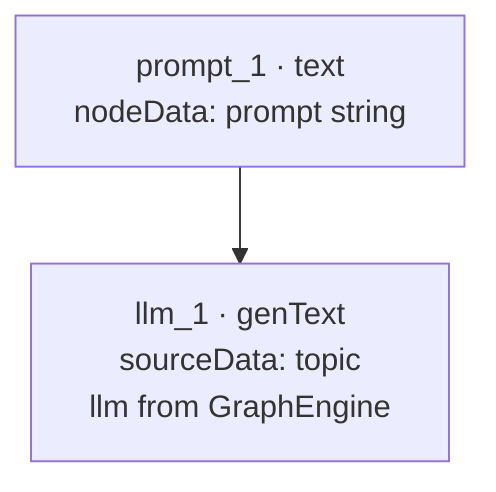

# LLM demo pipeline

**Run:** `npm run run:llm`  
**File:** [`examples/pipeline-llm-demo.json`](../../examples/pipeline-llm-demo.json)

Minimal **text → genText** chain. Uses `GraphEngine({ llm })` and the package builtin executor.



## Data flow



| Node | `node.type` | Role |
|------|-------------|------|
| `prompt_1` | `text` | User topic string |
| `llm_1` | `genText` | Calls Bedrock or OpenAI via `llm` config |

## Run

```bash
cp .env.template .env          # OpenAI-compatible
# or: cp .env.bedrock.template .env.bedrock

npm run run:llm
```

Uses [`examples/run-with-llm.mjs`](../../examples/run-with-llm.mjs) → `resolveLlmFromEnv()` → `GraphEngine({ llm })`.

## Payload

```json
{
  "nodes": [
    {
      "id": "prompt_1",
      "type": "text",
      "data": {
        "label": "Topic",
        "nodeData": "Explain what a DAG is in one short paragraph."
      }
    },
    {
      "id": "llm_1",
      "type": "genText",
      "data": {
        "label": "LLM",
        "isPassThrough": true,
        "nodeData": "Answer using the topic below."
      }
    }
  ],
  "edges": [
    { "id": "e-prompt-llm", "source": "prompt_1", "target": "llm_1" }
  ]
}
```

[LLM configuration](../llm-config.md) · [BYO LLM](../byo-llm.md) · [Examples index](./README.md)
