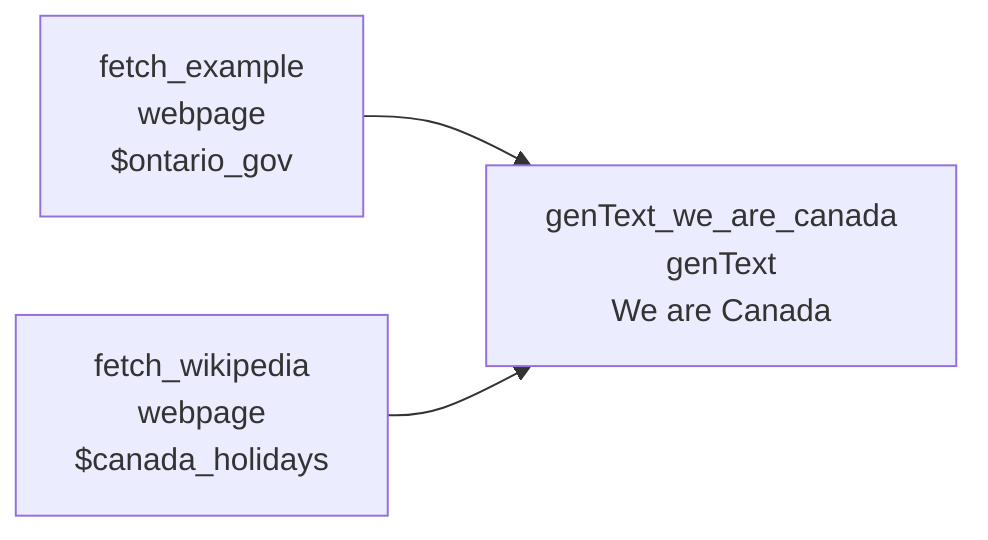
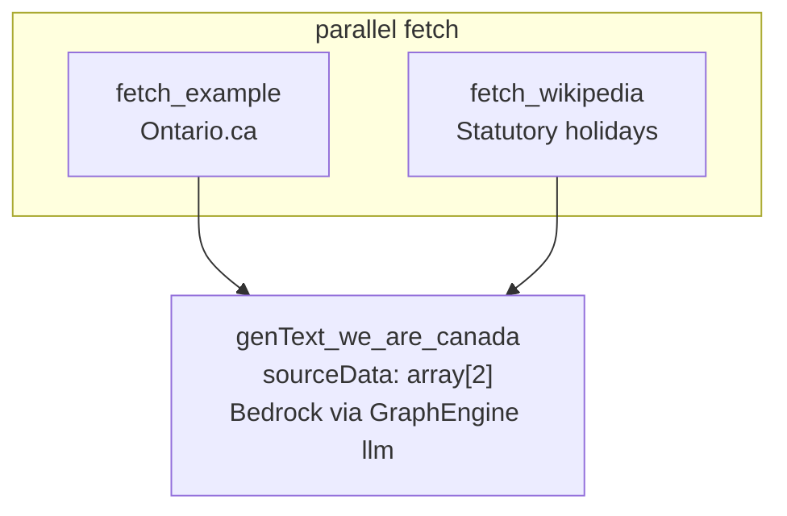

# Output chaining (fan-in → genText)

**Run:** `npm run run:output-chaining`  
**Pipeline:** [`examples/pipeline-output-chaining.json`](../../examples/pipeline-output-chaining.json)

**Output chaining** — two `webpage` nodes fetch in parallel, fan in to **`genText`** (same `node.type` as [arcpx-infra](https://github.com/arcpx-eng/async-dag) exports). Bedrock credentials are passed as `GraphEngine({ llm })` — locally from [`.env.bedrock`](../../.env.bedrock.template); in your app from code. See [LLM configuration](../llm-config.md).



Fan-in with named `outputTarget` → `{$ontario_gov}` / `{$canada_holidays}` in prompt:



| Node | `node.type` | Role |
|------|-------------|------|
| `fetch_example` | `webpage` | Ontario.ca |
| `fetch_wikipedia` | `webpage` | Statutory holidays |
| `genText_we_are_canada` | **`genText`** | Bedrock synthesis (ArcPX-compatible JSON) |

## ArcPX export compatibility

Use the same fields ArcPX puts in the graph:

- `type`: `"genText"`
- `data.isPassThrough`: `true`
- `data.nodeData`: string prompt — leading `System Prompt:` block plus `{$ontario_gov}`, `{$canada_holidays}` (names match upstream `outputTarget` without `$`); instructs the model to print sources (title + URL) in a **Sources** section
- `data.settings`: `modelId`, `region`, optional `outputPath`
- Upstream `webpage` nodes set `outputTarget` (e.g. `"$ontario_gov"`) so genText can reference each fetch by name

Export JSON from ArcPX → run with:

```bash
cp .env.bedrock.template .env.bedrock
npm run run:output-chaining
# or: node examples/run-with-llm.mjs ./your-exported-pipeline.json
```

## Programmatic (npm package)

```typescript
import {
  GraphEngine,
  loadFlowFromFile,
  createBuiltinNodeExecutor,
} from "async-dag";
import { createNodeExecutor } from "./examples/lib/handlers/index.mjs"; // + webpage

const flow = await loadFlowFromFile("./examples/pipeline-output-chaining.json");

const engine = new GraphEngine({
  flow,
  llm: {
    provider: "bedrock",
    apiKey: process.env.BEDROCK_API_KEY!,
    modelId: "us.anthropic.claude-sonnet-4-6",
    region: "us-east-1",
  },
  nodeExecutor: createNodeExecutor(), // package builtin + webpage handler
});

await engine.run();
```

## Fan-in

`genText` receives **`data.sourceData`** as an array of both fetch results. The handler builds the prompt (substituting `{$ontario_gov}`, `{$canada_holidays}`) and calls Bedrock Converse using `llm` settings on the engine.

## Output

- **LLM response** (string or `{ text, writtenTo }` when `settings.outputPath` is set)
- **File:** `examples/output/we-are-canada.md` (rendered model output)

## Handlers

- [`web-scraper/`](../../examples/node-types/web-scraper/) — `webpage`
- [`llm-bedrock/`](../../examples/node-types/llm-bedrock/) — `genText` + `LLM` → Bedrock

[LLM configuration](../llm-config.md) · [Node handlers](../node-handlers.md) · [BYO LLM](../byo-llm.md)
