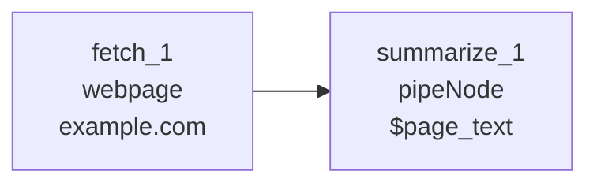
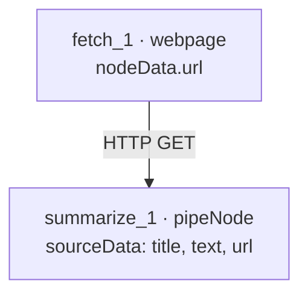

# Web scraper pipeline

**Run:** `npm run run:web-scraper`  
**File:** [`examples/web-scraper-pipeline.json`](../../examples/web-scraper-pipeline.json)

Fetch a URL with the **`webpage`** extension handler, then pass extracted text through **`pipeNode`**.



## Data flow



| Node | `node.type` | Output |
|------|-------------|--------|
| `fetch_1` | `webpage` | `{ url, title, text, status, … }` |
| `summarize_1` | `pipeNode` | `{ value, cells: { $page_text: … } }` |

`webpage` is registered via [extending the builtin executor](../extending-builtin-executor.md) — not in `createBuiltinNodeExecutor()` alone.

## Run

```bash
npm run run:web-scraper
```

## Payload

```json
{
  "nodes": [
    {
      "id": "fetch_1",
      "type": "webpage",
      "data": {
        "label": "Fetch example.com",
        "nodeData": { "url": "https://example.com", "maxChars": 8000 }
      }
    },
    {
      "id": "summarize_1",
      "type": "pipeNode",
      "data": {
        "label": "Page text",
        "outputTarget": "$page_text"
      }
    }
  ],
  "edges": [
    { "id": "e-fetch-summarize", "source": "fetch_1", "target": "summarize_1" }
  ]
}
```

[Web scraper handler](../../examples/node-types/web-scraper/README.md) · [Output chaining](./output-chaining.md) · [Examples index](./README.md)
