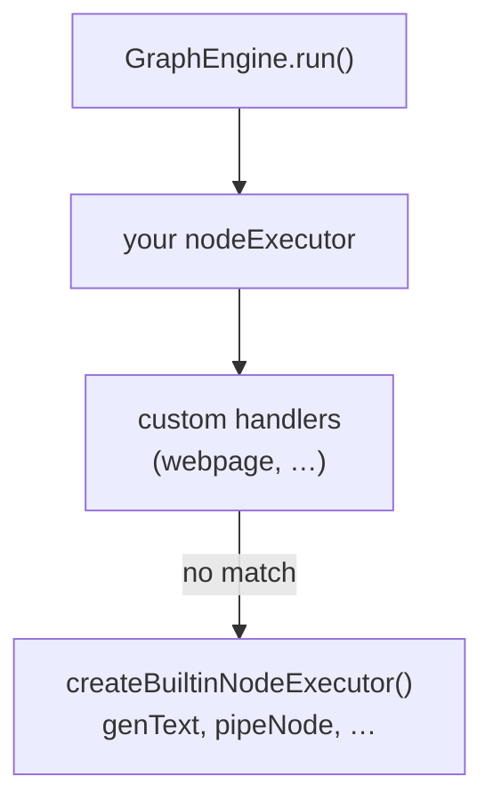

# Extending `createBuiltinNodeExecutor`

The npm package ships **`createBuiltinNodeExecutor()`** for ArcPX **core** node types (`genText`, `pipeNode`, `text`, `groupNode`, …). It does **not** include integrations like **`webpage`** (HTTP fetch) — you add those by composing a custom `nodeExecutor` that delegates unknown types to the builtin.

This guide uses **`webpage`** as the worked example (same pattern as [`examples/lib/handlers/index.mjs`](../examples/lib/handlers/index.mjs)).

## What the builtin covers

| `node.type` | Handled by package builtin |
|-------------|----------------------------|
| `genText`, `LLM` | Yes — reads `GraphEngine({ llm })` from `node.data.settings` |
| `pipeNode` | Yes — pass-through + `outputTarget` / `cells` |
| `text`, `startNode`, `endNode`, `standardOutput`, `groupNode` | Yes |
| `webpage`, `webScraper` | **No** — you register a custom handler |
| `bigQuery`, `aiRepos`, … | **No** — custom or community handlers |

Unknown types return a **stub** (does not throw) so you can see which types still need handlers:

```json
{
  "stub": true,
  "type": "webpage",
  "note": "Unknown node.type \"webpage\". Register a custom handler..."
}
```

## Composition pattern

Wrap the builtin: try your handlers first, then fall back to `createBuiltinNodeExecutor()`.



Resolution order in the async-dag examples:

1. **Extension handlers** — `webpage`, OpenAI `llm` / `chat`
2. **Community registry** — `bigQuery`, `markdownOutput`, generated types
3. **Package builtin** — everything else the package knows

## Step 1 — Implement a handler (`webpage`)

A handler is an async function `(node) => unknown`. The engine sets **`node.data.sourceData`** (upstream output) and **`node.data.settings`** (merged `llm` + `globalSettings`) before each call.

Reference implementation: [`examples/node-types/web-scraper/executor.example.mjs`](../examples/node-types/web-scraper/executor.example.mjs).

```javascript
export function createWebpageHandler() {
  return async function webpageNode(node) {
    const data = node.data ?? {};
    const config = data.nodeData;

    if (!config || typeof config !== "object" || !config.url) {
      throw new Error("webpage: data.nodeData object required with { url }");
    }

    const url = String(config.url).trim();
    const res = await fetch(url, { signal: AbortSignal.timeout(config.timeoutMs ?? 15_000) });
    const raw = await res.text();
    // … html → text extraction …

    const payload = {
      label: data.label ?? null,
      url,
      title: "…",
      text: "…",
      status: res.status,
    };

    // Optional: name output for downstream genText placeholders ({$my_var})
    if (data.outputTarget) {
      const target = String(data.outputTarget);
      payload.outputTarget = target;
      payload.cells = { [target]: { ...payload } };
    }

    return payload;
  };
}
```

### Pipeline JSON for `webpage`

```json
{
  "id": "fetch_example",
  "type": "webpage",
  "data": {
    "label": "Canada Government",
    "outputTarget": "$ontario_gov",
    "nodeData": {
      "url": "https://www.ontario.ca/page/government-ontario",
      "maxChars": 6000,
      "timeoutMs": 20000
    }
  }
}
```

Downstream `genText` can reference `{$ontario_gov}` when `outputTarget` is set. See [Output chaining](./examples/output-chaining.md).

## Step 2 — Register the handler

### JavaScript (minimal)

```javascript
import {
  GraphEngine,
  loadFlowFromFile,
  createBuiltinNodeExecutor,
} from "async-dag";
import { createWebpageHandler } from "./handlers/webpage.mjs";

const customHandlers = new Map([
  ["webpage", createWebpageHandler()],
  ["webScraper", createWebpageHandler()], // alias
]);

const coreBuiltin = createBuiltinNodeExecutor();

const nodeExecutor = async (node) => {
  const type = node.type ?? "unknown";
  const custom = customHandlers.get(type);
  if (custom) return custom(node);
  return coreBuiltin(node);
};

const engine = new GraphEngine({
  flow: await loadFlowFromFile("./pipeline.json"),
  llm: {
    provider: "bedrock",
    apiKey: process.env.BEDROCK_API_KEY,
    modelId: "us.anthropic.claude-sonnet-4-6",
    region: "us-east-1",
  },
  nodeExecutor,
});

await engine.run();
```

### TypeScript

```typescript
import {
  GraphEngine,
  loadFlowFromFile,
  createBuiltinNodeExecutor,
  type FlowNode,
  type NodeExecutor,
} from "async-dag";

type NodeHandler = (node: FlowNode) => Promise<unknown>;

function extendBuiltinNodeExecutor(
  handlers: Record<string, NodeHandler>,
): NodeExecutor {
  const coreBuiltin = createBuiltinNodeExecutor();
  return async (node) => {
    const type = node.type ?? "unknown";
    const handler = handlers[type];
    if (handler) return handler(node);
    return coreBuiltin(node);
  };
}

const engine = new GraphEngine({
  flow: await loadFlowFromFile("./pipeline.json"),
  llm: { provider: "bedrock", apiKey: "…", modelId: "…" },
  nodeExecutor: extendBuiltinNodeExecutor({
    webpage: createWebpageHandler(),
    webScraper: createWebpageHandler(),
  }),
});
```

Copy `extendBuiltinNodeExecutor` into your project, or import the example implementation below.

## Step 3 — Example repo layout (async-dag)

The async-dag repo uses this structure:

| File | Role |
|------|------|
| [`examples/node-types/web-scraper/executor.example.mjs`](../examples/node-types/web-scraper/executor.example.mjs) | `webpage` handler |
| [`examples/lib/handlers/builtin.mjs`](../examples/lib/handlers/builtin.mjs) | `buildExtensionHandlers()` — maps type → handler |
| [`examples/lib/handlers/index.mjs`](../examples/lib/handlers/index.mjs) | `createNodeExecutor()` — extensions + community + builtin |
| [`examples/node-types/registry.mjs`](../examples/node-types/registry.mjs) | Community / generated handlers |

```javascript
// examples/lib/handlers/index.mjs (simplified)
import { createBuiltinNodeExecutor } from "async-dag";
import { buildExtensionHandlers } from "./builtin.mjs";
import { loadCommunityHandlers } from "../node-types/registry.mjs";

export function createNodeExecutor() {
  const extensions = buildExtensionHandlers();
  const community = loadCommunityHandlers();
  const coreBuiltin = createBuiltinNodeExecutor();

  return async (node) => {
    const type = node.type ?? "unknown";
    const handler = extensions.get(type) ?? community.get(type);
    if (handler) return handler(node);
    return coreBuiltin(node);
  };
}
```

Run a pipeline that uses `webpage` → `genText`:

```bash
npm run build
cp .env.bedrock.template .env.bedrock   # set BEDROCK_API_KEY
npm run run:output-chaining
```

Or:

```bash
node examples/run-with-llm.mjs examples/pipeline-output-chaining.json
```

## Handler contract checklist

| Field | Set by | Your handler should |
|-------|--------|---------------------|
| `node.type` | Pipeline JSON | Match your map key (`"webpage"`) |
| `node.data.nodeData` | Pipeline JSON | Read config (object for `webpage`, string for `genText`) |
| `node.data.sourceData` | **GraphEngine** | Use upstream output when node has parents |
| `node.data.settings` | **GraphEngine** | Read `llm` / `globalSettings` if needed |
| `node.data.outputTarget` | Pipeline JSON | Echo on return + `cells` for named `genText` placeholders |
| Return value | Your handler | JSON-serializable; passed as next node's `sourceData` |

## Multiple custom types

Add more entries to your handler map or registry:

```javascript
const customHandlers = new Map([
  ["webpage", createWebpageHandler()],
  ["myWebhook", createMyWebhookHandler()],
]);

// Or use npm run generate:handler -- myWebhook
// → examples/node-types/my-webhook/ + registry.mjs
```

Scaffold new types interactively:

```bash
npm run generate:handler
```

See [Node handlers](./node-handlers.md).

## Override a builtin type

Custom handlers run **before** the builtin in the example executor. To replace `genText` behavior, register your own `genText` handler and **do not** call `coreBuiltin` for that type.

Generally prefer **`llm` on `GraphEngine`** + package builtin for `genText` unless you need a fully custom LLM client.

## Testing

Unit-test your handler with a minimal `FlowNode`:

```javascript
import { describe, it } from "node:test";
import assert from "node:assert/strict";
import { createWebpageHandler } from "./webpage.mjs";

describe("webpage handler", () => {
  it("returns text extract shape", async () => {
    // mock globalThis.fetch …
    const handler = createWebpageHandler();
    const result = await handler({
      id: "w",
      type: "webpage",
      data: {
        label: "Test",
        nodeData: { url: "https://example.com" },
      },
    });
    assert.equal(result.url, "https://example.com");
    assert.ok(typeof result.text === "string");
  });
});
```

Integration test with `GraphEngine`: see [`test/output-chaining-engine.test.mjs`](../test/output-chaining-engine.test.mjs).

## See also

- [LLM configuration](./llm-config.md) — `GraphEngine({ llm })`
- [Core node types](./core-node-types.md) — what the builtin already handles
- [Node handlers](./node-handlers.md) — generator + community registry
- [Web scraper example](../examples/node-types/web-scraper/README.md) — `webpage` details
- [API reference](./api.md) — `NodeExecutor`, `FlowNode`
