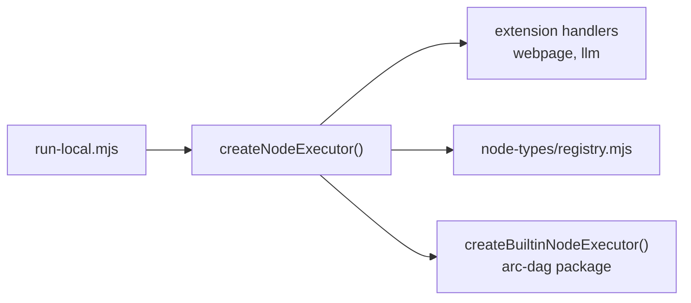

# Node handlers (local runner)

arc-dag runs every node in your pipeline JSON. **`nodeExecutor`** (in [`examples/run-local.mjs`](../examples/run-local.mjs)) must handle each `node.type` — otherwise you see a **stub** response:

```json
{
  "stub": true,
  "note": "No local handler for \"aiRepos\". Run: npm run generate:handler -- aiRepos"
}
```

That is expected until you add a handler.

## Quick fix: generate a handler (interactive)

From the repo root, run the wizard (no args):

```bash
npm run generate:handler
```

It will ask for:

| Prompt | Example |
|--------|---------|
| `node.type` | `aiRepos`, `groupNode` |
| Handler kind | container (layout) vs integration (API/data) |
| Sample label | `AI Repos` |
| Description | One line for README |
| Sample `nodeData` JSON | Paste from your ArcPX export |
| Env vars | `GITHUB_TOKEN`, etc. (optional, repeat until empty) |

Pre-fill the type only:

```bash
npm run generate:handler -- aiRepos
```

Use `--force` to overwrite an existing folder. Review the summary, confirm with `y`, then files are written.

This creates:

```
examples/node-types/<slug>/
  executor.example.mjs   # your handler
  README.md
  node.sample.json
```

…and registers it in [`examples/node-types/registry.mjs`](../examples/node-types/registry.mjs).

Then implement the TODO in `executor.example.mjs` and run:

```bash
npm run build
node examples/run-local.mjs ./your-pipeline.json
```

### Handler kinds (chosen in the wizard)

| Kind | Use for | Behavior |
|------|---------|----------|
| `container` | `groupNode`, layout groups | Pass-through — no API |
| `integration` | `aiRepos`, `bigQuery`, webhooks | Stub + env checks until you implement |

## Core types (ArcPX — package builtin)

See **[core-node-types.md](./core-node-types.md)** — `createBuiltinNodeExecutor()` from `arc-dag`.

Includes **`pipeNode`**, **`genText`**, `text`, `groupNode`, and more. **`webpage`** and integrations are **extensions** — see **[Extending the builtin executor](./extending-builtin-executor.md)**.

## Community types

[`examples/node-types/registry.mjs`](../examples/node-types/registry.mjs) — `bigQuery`, `xApi`, `markdownOutput`, custom types from `npm run generate:handler`.

## How wiring works



1. **Extension** handlers (`webpage`, …) — [`handlers/builtin.mjs`](../examples/lib/handlers/builtin.mjs)
2. **Community** registry (`bigQuery`, generated types, …)
3. **Package builtin** (`genText`, `pipeNode`, …) — fallback

Full guide: **[Extending the builtin executor](./extending-builtin-executor.md)** (`webpage` walkthrough).

## `groupNode` and canvas-only nodes

`groupNode` is a **visual group** on the canvas (children use `parentId`). It is not a data step — the built-in handler returns metadata only. You do not need to generate a handler unless you want a custom folder for documentation.

Edges should connect **executable** nodes (`aiRepos`, `pipeNode`, `genText`, …), not through the group id.

## List types in your pipeline

```bash
node -e "
import { loadFlowFromFile } from './dist/index.js';
const f = await loadFlowFromFile(process.argv[1]);
console.log([...new Set(f.nodes.map(n => n.type))].sort().join('\n'));
" ./pipeline.json
```

Generate a handler for each type that is not built-in.

## Community handlers

See [`examples/node-types/README.md`](../examples/node-types/README.md) for PRs (BigQuery, X API, **web scraper**, etc.).

### Web scraper (`webpage`)

```bash
npm run run:web-scraper
```

[`examples/node-types/web-scraper/`](../examples/node-types/web-scraper/README.md) — `nodeData.url`, returns `{ title, text, ... }`.

### Output chaining (fan-in → genText)

```bash
cp .env.bedrock.template .env.bedrock
npm run run:output-chaining
```

[`pipeline-output-chaining.json`](../examples/pipeline-output-chaining.json) — leaf `genText` + Bedrock ([`llm-bedrock/`](../examples/node-types/llm-bedrock/README.md)).

## See also

- [Extending the builtin executor](./extending-builtin-executor.md) — `webpage` + `createBuiltinNodeExecutor`
- [Payload guide](./payload-guide.md) — `nodeData` shapes
- [BYO LLM](./byo-llm.md) — `genText` / chat nodes
- [Scripts](./scripts.md)
